<div align="center">

# 🎓 EduMate

### Smart College Management Platform

**Students • Teachers • Administrators**

Built with **Flutter + Firebase + Supabase**


</div>

---

## 🔐 Private Project

**EduMate is a private application.**

The source code and application are not intended for unrestricted public use, redistribution, or commercial use.

If you would like to **use, test, deploy, customize, or obtain access** to EduMate, please contact the developer and request permission first.

**Developer:** Rohan Mondal  
**GitHub:** `https://github.com/Rohanmon80`

Permission may be granted on a case-by-case basis.

---

## 📱 About EduMate

**EduMate** is a college management application designed to bring students, teachers, and administrators together through a single platform.

| Role | Main Purpose |
|---|---|
| 👨‍🎓 Student | Attendance, marks, timetable, notices, materials and PPT submission |
| 👨‍🏫 Teacher | Attendance, marks, materials, notices and PPT submissions |
| 👨‍💼 Admin | Student management, teacher management, fees, reports and administration |

---

# ✨ Key Features

## 👨‍🎓 Student Portal

- 📊 Student dashboard
- 👤 Student profile
- 📅 Attendance
- 📝 Results and marks
- 🗓️ Timetable
- 🔔 Notices
- 📚 Study materials
- 💰 Fee information
- 📝 Exam-related information
- 📑 Mid-examination PPT submission
- 👨‍🏫 Teacher selection before PPT submission
- ☁️ PPT upload using Supabase Storage

### 📑 PPT Submission

Students can:

1. Enter the PPT title.
2. Select the teacher who should receive the presentation.
3. Select a `.ppt` or `.pptx` file.
4. Submit the presentation.
5. Store submission metadata in Firestore.

---

## 👨‍🏫 Teacher Portal

- 📊 Teacher dashboard
- 📝 Attendance management
- 🔢 Student roll-number list
- ✅ Present / ❌ Absent marking
- 🕐 Attendance history
- 📈 Marks management
- 🗓️ Timetable
- 🔔 Notices
- 📚 Study materials
- 📑 Student PPT submissions

### 📑 PPT Submissions

Teachers can view PPTs assigned specifically to their account.

The submission view includes:

- Student name
- Roll number
- Department
- Year
- Semester
- Section
- PPT title
- PPT filename
- Submission date/time
- Submission status
- View PPT option

---

## 👨‍💼 Admin Portal

- 📊 Admin dashboard
- 👨‍🎓 Student management
- 👨‍🏫 Teacher management
- 📝 Attendance management
- 💰 Fee management
- 📈 Reports
- 📝 Examination management
- 🔔 Notice management

---

# 🖼️ Application Screenshots

## 🚀 App Entry

### Splash Screen


### Role Selection

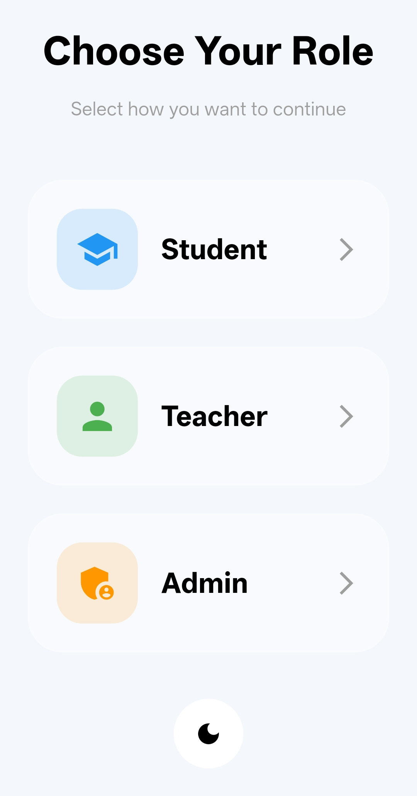

---

# 👨‍🎓 Student Experience

| Dashboard | Attendance |
|---|---|
| 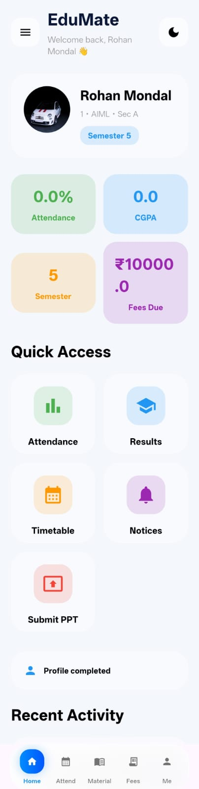 | 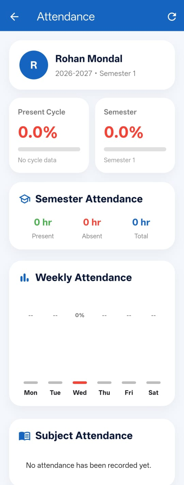 |

| Marks | Results |
|---|---|
| 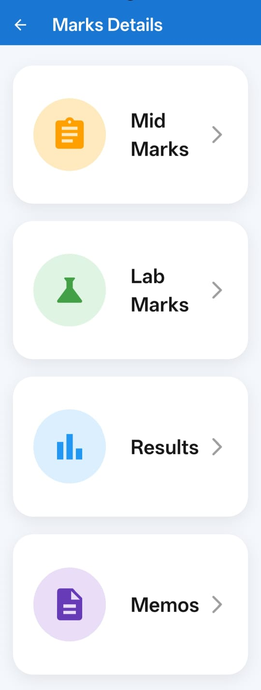 | 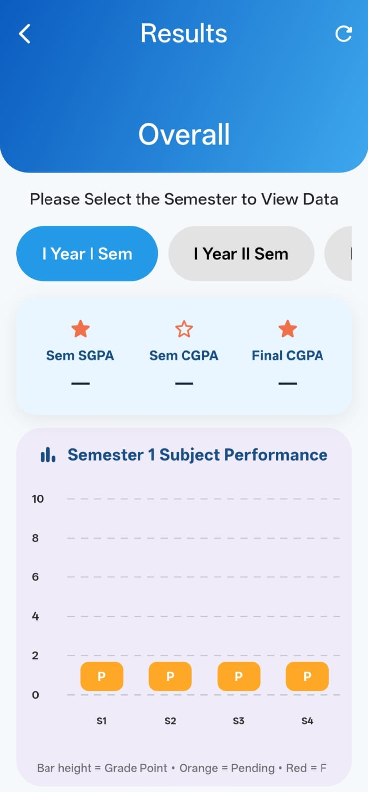 |

### 🗓️ Timetable

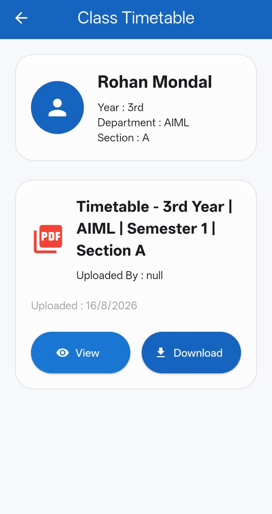

---

# 👨‍🏫 Teacher Experience

| Dashboard | Attendance |
|---|---|
| 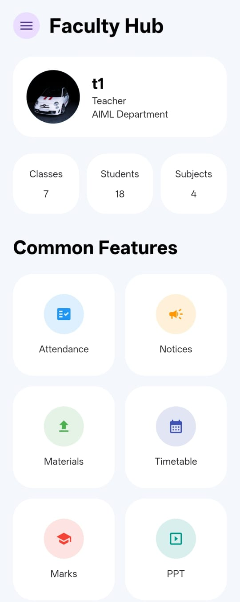 | 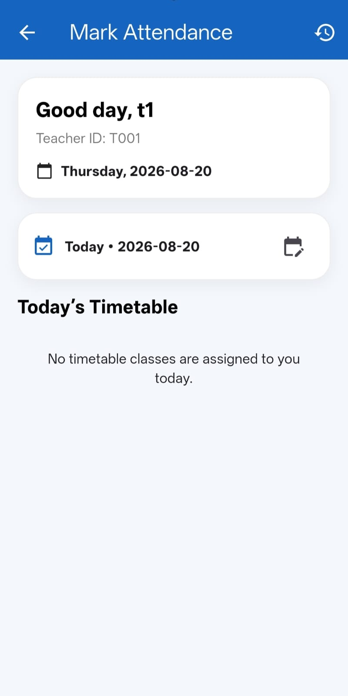 |

| Marks | Materials |
|---|---|
| 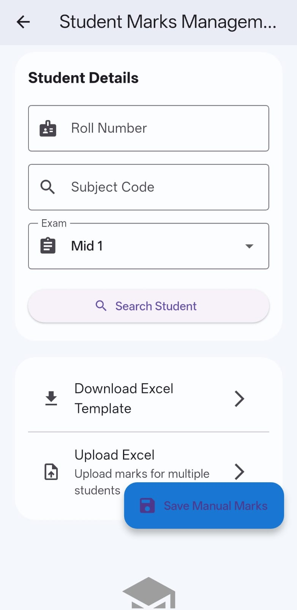 | 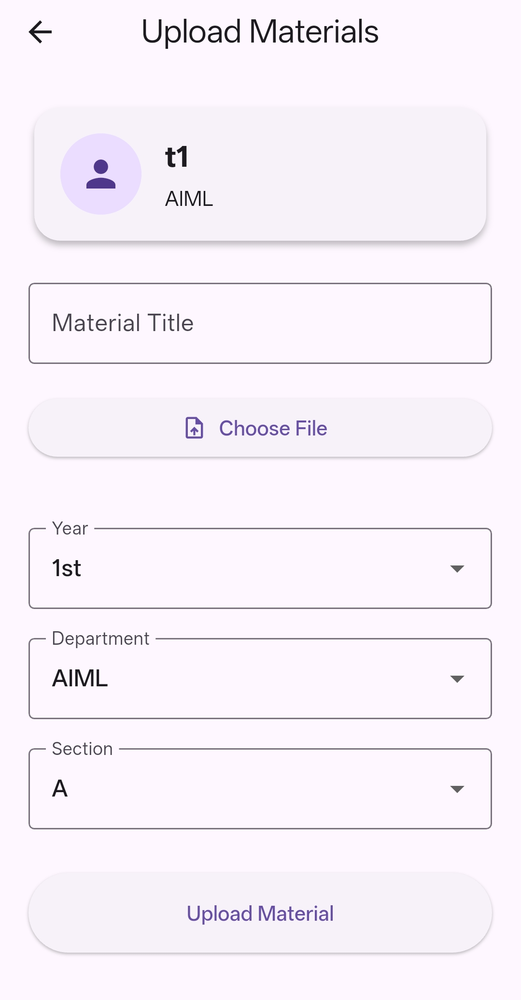 |

### 📑 Student PPT Submissions

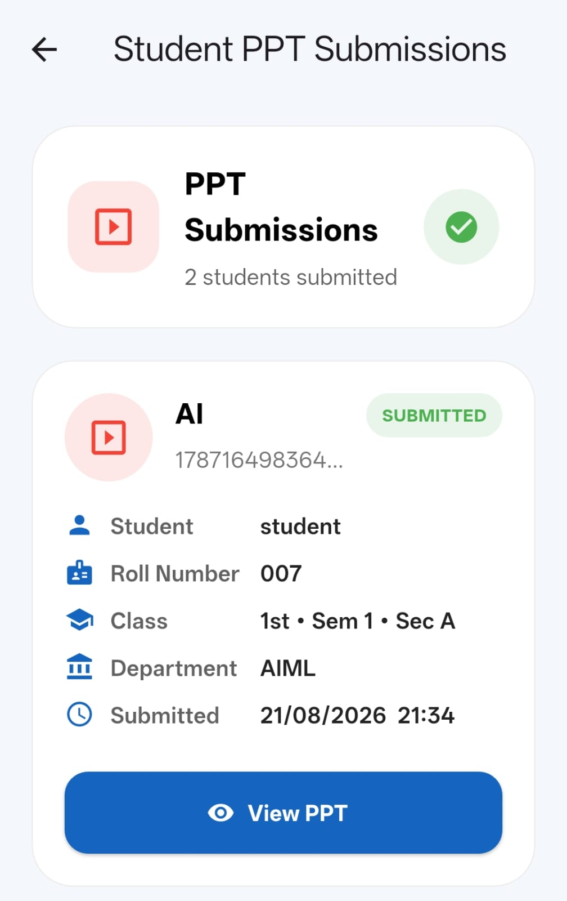

---

# 👨‍💼 Admin Experience

| Dashboard | Student Management |
|---|---|
| 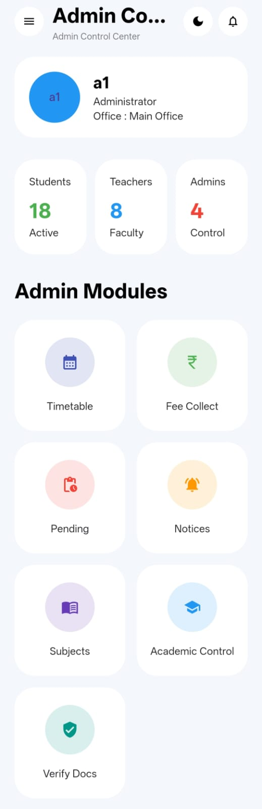 | 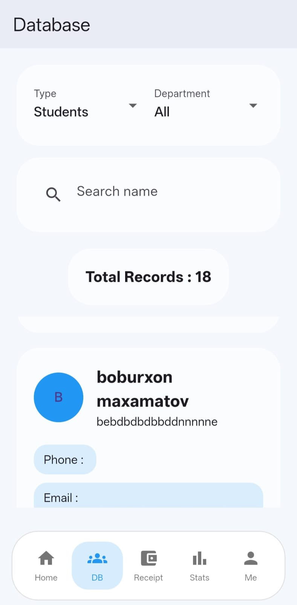 |

### 📈 Admin Reports

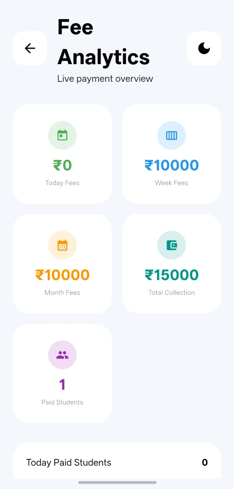

---

# 🏗️ Application Architecture

```text
                         ┌──────────────────┐
                         │      EduMate     │
                         └────────┬─────────┘
                                  │
              ┌───────────────────┼───────────────────┐
              │                   │                   │
          👨‍🎓 Student         👨‍🏫 Teacher         👨‍💼 Admin
              │                   │                   │
              └───────────────────┼───────────────────┘
                                  │
                                  ▼
                         ┌──────────────────┐
                         │  Firebase Auth   │
                         │ User Identity    │
                         └────────┬─────────┘
                                  │
                                  ▼
                         ┌──────────────────┐
                         │ Cloud Firestore  │
                         │ App Data/Records │
                         └────────┬─────────┘
                                  │
                            PPT Metadata
                                  │
                                  ▼
                         ┌──────────────────┐
                         │ Supabase Storage │
                         │ PPT / Documents  │
                         └──────────────────┘
```

---

# 📑 PPT Submission Flow

```text
Student
   │
   ▼
Enter PPT Title
   │
   ▼
Select Teacher
   │
   ▼
Select .ppt / .pptx
   │
   ▼
Upload ───────────────► Supabase Storage
   │
   ▼
Save Metadata ────────► Cloud Firestore
   │
   ▼
Store Teacher UID
   │
   ▼
Selected Teacher
   │
   ▼
View Submitted PPT
```

### Submission Metadata

```text
studentUid
studentName
rollNumber

department
year
semester
section

pptTitle
fileName
fileUrl

teacherId
teacherUid
teacherName

submittedAt
status
```

---

# 🔐 Authentication

EduMate uses **Firebase Authentication** for user identity.

Supported roles:

```text
Student
Teacher
Admin
```

Each role has a dedicated dashboard and role-specific functionality.

---

# 🛠️ Technology Stack

| Technology | Purpose |
|---|---|
| 🐦 Flutter | Cross-platform application UI |
| 🎯 Dart | Application programming language |
| 🔥 Firebase Auth | User authentication |
| ☁️ Cloud Firestore | Application database and metadata |
| ⚡ Supabase Storage | PPT and file storage |
| 🎨 Material Design | UI components |

---

# 📁 Project Structure

```text
EduMate/
│
├── README.md
├── COPYRIGHT.md
├── pubspec.yaml
│
├── assets/
│   └── screenshots/
│       ├── splash_screen.png.jpeg
│       ├── role_selection.png.jpeg
│       ├── student_dashboard.png.jpeg
│       ├── student_attendance.png.jpeg
│       ├── student_marks.png.jpeg
│       ├── student_results.png.jpeg
│       ├── student_timetable.png.jpeg
│       ├── teacher_dashboard.png.jpeg
│       ├── teacher_attendance.png.jpeg
│       ├── teacher_marks.png.jpeg
│       ├── teacher_materials.png.jpeg
│       ├── teacher_ppt_submissions.png.jpeg
│       ├── admin_dashboard.png.jpeg
│       ├── admin_student_management.png.jpeg
│       └── admin_reports.png.jpeg
│
├── lib/
│   ├── student/
│   ├── teacher/
│   ├── admin/
│   ├── services/
│   ├── timetables/
│   ├── firebase_options.dart
│   ├── main.dart
│   └── splash_screen.dart
│
├── android/
├── ios/
└── web/
```

---

# 🚀 Getting Started

> Access to this project requires permission from the developer.

After permission has been granted:

### 1. Clone

```bash
git clone YOUR_REPOSITORY_URL
cd EduMate
```

### 2. Install dependencies

```bash
flutter pub get
```

### 3. Configure Firebase

Configure Firebase for the required platform and ensure the project's Firebase configuration is available.

### 4. Configure Supabase

Supabase is initialized in `main.dart`.

The PPT submission system uses:

```text
student-ppts
```

as the Storage bucket for PowerPoint files.

### 5. Run

```bash
flutter run
```

---

# 📦 Build APK

```bash
flutter build apk --release
```

APK output:

```text
build/app/outputs/flutter-apk/app-release.apk
```

---

# 🔒 Security & Privacy

EduMate uses:

- Firebase Authentication for user identity
- Cloud Firestore for application and submission metadata
- Supabase Storage for uploaded files
- Teacher-specific PPT assignment using `teacherUid`

Storage policies should be reviewed and configured correctly before production deployment.

See [`COPYRIGHT.md`](COPYRIGHT.md) for project usage restrictions.

---

# 🔮 Future Improvements

- 🔔 Push notifications
- 📑 Assignment management
- 🏆 PPT grading and teacher feedback
- 📝 Student leave requests
- 💳 Online fee payment
- 📊 Advanced attendance analytics
- 🔔 Exam result notifications
- 👨‍👩‍👦 Parent/guardian portal
- 🧑‍💻 Online examinations
- 💬 Student-teacher communication
- 📈 Advanced administrative reports
- 🔒 Private Supabase Storage with signed URLs

---

# 👨‍💻 Developer

<div align="center">

## Rohan Mondal

**B.Tech — Artificial Intelligence & Machine Learning**

GitHub: `https://github.com/Rohanmon80`

</div>

---

# 📄 Copyright & License

EduMate is **proprietary software**.

All rights are reserved by the developer unless explicitly stated otherwise.

See [`COPYRIGHT.md`](COPYRIGHT.md) for the complete usage and copyright terms.

> **Unauthorized use, redistribution, modification, deployment, or commercial use is not permitted without prior permission from the developer.**

---

<div align="center">

### 🎓 EduMate

**Connecting Students • Teachers • Administration**

*Built with Flutter, Firebase & Supabase*

</div>
